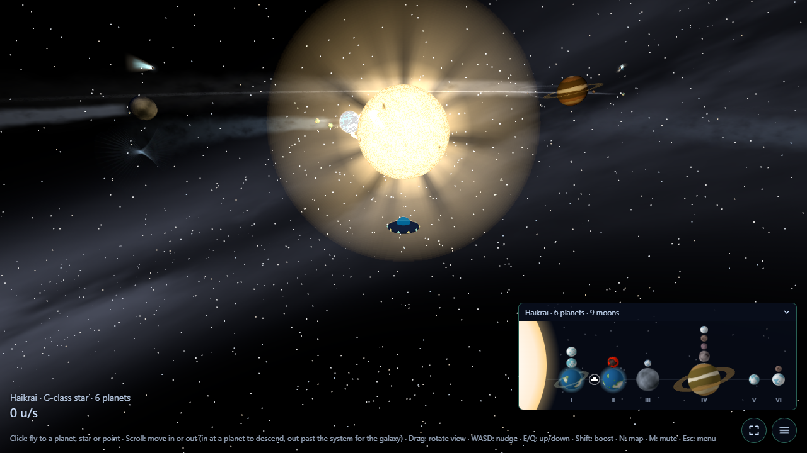
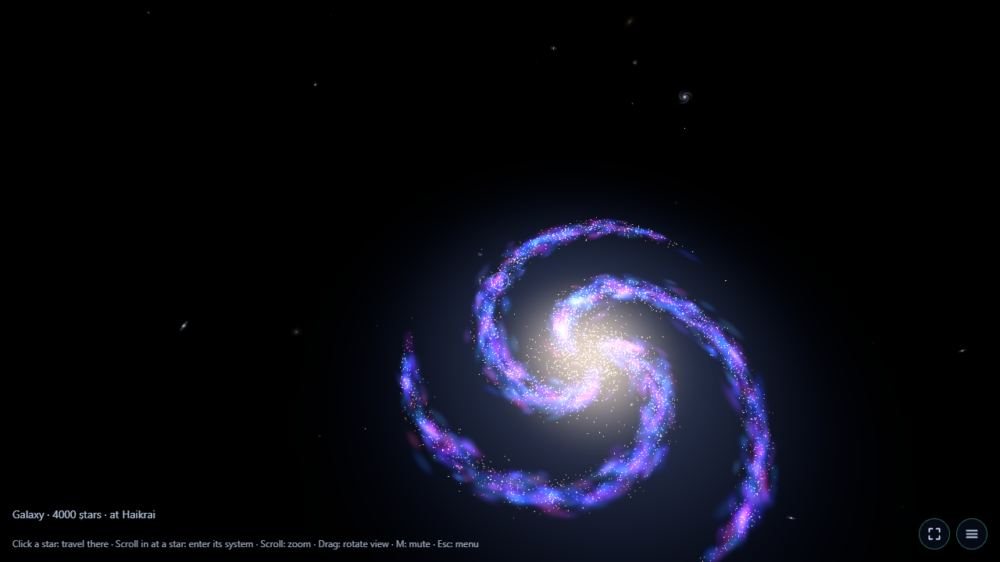
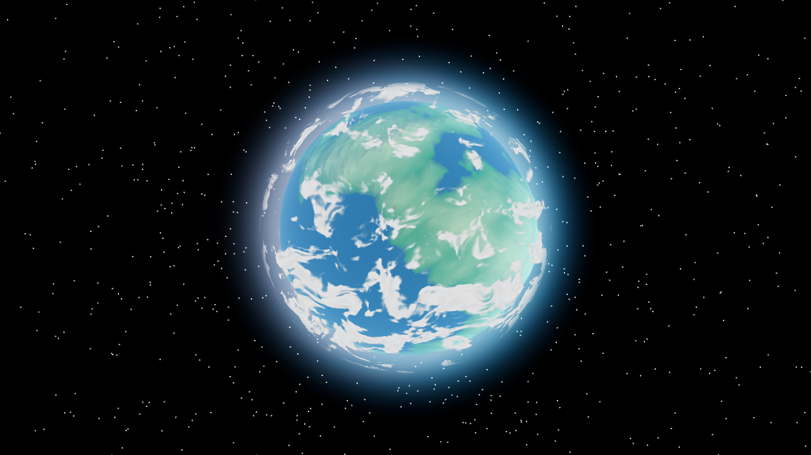
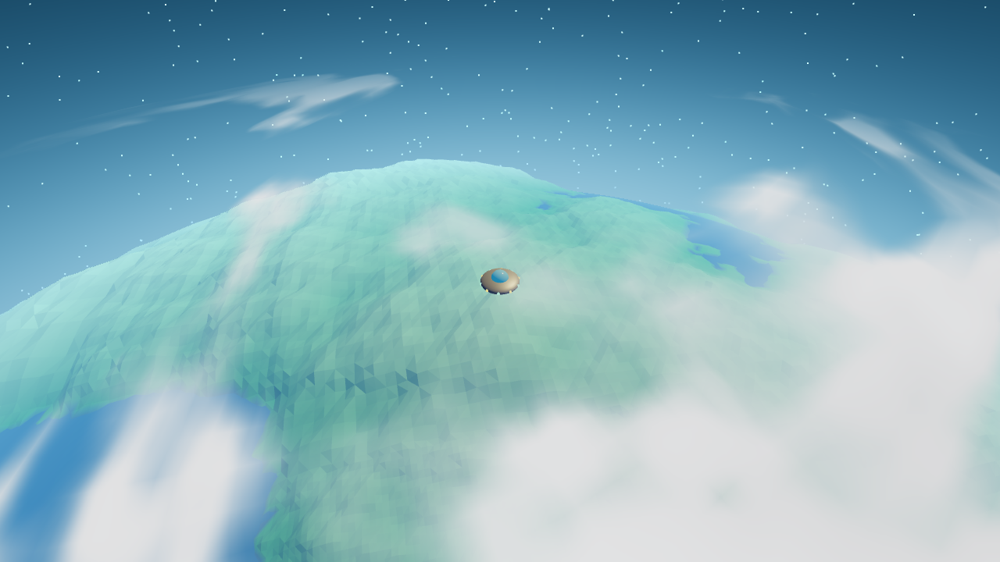
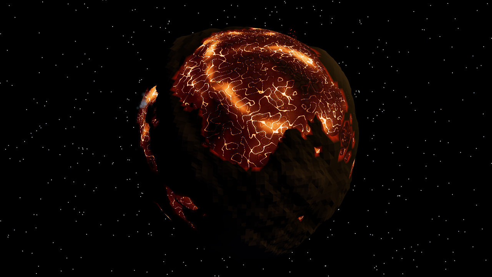

# Spore 2: space stage

A browser game inspired by the space stage of *Spore*. Fly a UFO through a procedurally generated spiral galaxy, zoom from the galaxy map into a star system and all the way down to low orbit over a planet, in one continuous scroll.

**Play it:** https://elmaxe.github.io/sporer/ · **Planet lab:** https://elmaxe.github.io/sporer/lab.html · **Plant lab:** https://elmaxe.github.io/sporer/plants.html · **Animal lab:** https://elmaxe.github.io/sporer/animals.html



## Screenshots

| | |
|---|---|
|  |  |
| **The galaxy.** 4000 stars in spiral arms. Click one to travel there, then scroll in to enter its system. | **A planet from orbit.** Continents, seas, drifting clouds and an atmosphere that hazes at the limb. |
|  |  |
| **Low orbit.** Scroll in on a planet to go down and fly over its surface. | **A lava world.** Animated molten seas with a cracking crust, and eruptions up close. |

## What's in it

- **One seed, a whole galaxy.** Everything is procedural and deterministic: the same `?seed=` always gives the same stars, planets, moons and climates, and a system is identical every time you return.
- **Seamless zoom between scales.** Galaxy → system → low orbit and back with the scroll wheel, crossfading between levels without cutting to black.
- **Spore-style controls.** Click a star, planet or point to autopilot there. Scroll to zoom, drag to orbit the camera, WASD to nudge. Touch controls on phones.
- **Living stars.** Granulation, sunspots, prominences and flares. Main-sequence stars of every class, red and white dwarfs, giants and binaries.
- **Varied worlds.** Lava, barren, desert, terran, ocean, ice and gas giants, from tiny moons to huge Jupiters, with rings, moons and comets on elliptical orbits; fly down to a comet's lumpy nucleus and watch its jets wake near the star.
- **Asteroid belts.** Main belts with Kirkwood gaps, icy outer belts and Trojan swarms, thousands of tumbling rocks up close and a dusty band from afar; visit their named asteroids, contact binaries included.
- **Climate from real physics.** Temperature, air pressure and composition, and geothermal heat follow the star, the orbit and the body's size. They drive atmospheres, lava, cryo and steam geysers, and weather (clouds, storms, rain, snow and lightning). Habitable worlds grow plants, more species and denser cover the more Earth-like they are. The numbers are checked against real references in [`docs/research/`](docs/research/).
- **Nebulas.** Named emission, reflection and dark nebulas, planetary nebulas round white dwarfs and supernova remnants on the galaxy map. Fly into one and its gas fills the sky of the systems inside, down to low orbit.
- **Rogue planets.** A handful of planets drift between the stars with no sun, faint rings on the galaxy map. Fly to one and it's a dark, frozen world lit only by the galaxy's glow and its own heat: glowing lava cracks, ice geysers, and under a thick hydrogen sky, sometimes a warm hidden sea.
- **Our own solar system.** Every galaxy has Sol (start there with `?star=sol`): the Sun, the eight planets with their major moons, Pluto and Charon, the asteroid belt with Ceres and Vesta, Jupiter's Trojans, the Kuiper belt and Halley's comet, with their real sizes, tilts and climates. Earth, the Moon, Mars and Pluto wear real NASA maps (continents, maria, Valles Marineris, the heart), Jupiter has its Great Red Spot, Saturn its rings and hexagon, Neptune its Great Dark Spot.
- **Maps.** A row-of-planets system map and an Equal Earth map of the planet you're orbiting.
- **Sound.** Music, ambience and sound effects from audio files (variants per cue in `src/assets/audio/sfx/`): selecting a body, travel loops, reentry and leaving a planet.

## Controls

| | |
|---|---|
| Left-click | Fly to a star, planet or point |
| Scroll | Zoom. Past the limits it moves between galaxy, system and low orbit |
| Drag | Rotate the camera |
| WASD, E/Q | Nudge the ship, up/down |
| Shift | Boost |
| N / M | Map / mute |
| Esc | Menu |
| F8 | Debug dump (also in the menu): mark the problem on the screenshot, add a note, save or share one file to send |

## Planet lab

[`lab.html`](https://elmaxe.github.io/sporer/lab.html) draws one planet or moon with the game's own code and lets you edit every property: type, size, colours, sea, relief, gas bands, atmosphere, climate and weather, rings, moons, light and time. Use `?gen=<seed>&type=<type>&kind=<size>` to make one, or `?seed=<galaxy>&star=<id>&planet=<i>` to load one from the game. The game's menu opens the current planet in it.

## Plant lab

[`plants.html`](https://elmaxe.github.io/sporer/plants.html) grows plant species with the game's own generator and draws them with its own renderer. Every species is generated: conifers, broadleaf trees, palms and shrubs, branching by Leonardo's rule and the golden angle, at four levels of detail. You can edit everything: size, crown, colours, climate, branching, leaves and flowers. Look at one plant (zoom out to watch the game's level-of-detail crossfade), all its levels side by side, or a grove planted by the game's own plant system on a whole planet you can zoom out from and turn, with the levels tinted. Use `?gen=<seed>&kind=<tree|largeBush|smallBush>&arch=<conifer|broadleaf|palm|shrub>` to make a set, or `?seed=<galaxy>&star=<id>&planet=<i>` to load a game planet's plants. The planet lab's **Plants** link opens its planet's species.

## Animal lab

[`animals.html`](https://elmaxe.github.io/sporer/animals.html) generates animal species with the game's own generator and draws and walks them with its own renderer. Animals roam every world where plants grow (a habitable tier, so terraforming a world brings them): soft, round, cute four-legged, six-legged and two-legged bodies grown round a spine (big heads and eyes, short snouts, plump bodies), with horns, ears, crests and countershaded, patterned coats, walking in real gait patterns at speeds set by their legs and the planet's gravity, in herds that graze and wander. You can edit everything: size, diet, herd, proportions, features and coat. Watch one animal stand, graze, walk or trot round a circle (zoom out to see the levels of detail), its levels side by side, the whole set side by side, or herds roaming a whole planet. Use `?gen=<seed>&diet=<herbivore|carnivore>&plan=<quadruped|hexapod|biped>` to make a set, or `?seed=<galaxy>&star=<id>&planet=<i>` to load a game planet's animals. The planet lab's **Animals** link opens its planet's species.

## Running it

Needs Node.js.

```bash
npm install
npm run dev        # http://localhost:5173 (debug panel on)
```

| Command | Does |
|---|---|
| `npm run typecheck` | TypeScript checks |
| `npm test` | Unit tests (Vitest) |
| `npm run build` / `npm run preview` | Production build and a local preview of it |
| `npm run smoke` | Headless browser check of the whole game (needs the dev server running) |
| `npm run shot` | Scripted in-game screenshots (`-- --dump <file>` restores a debug dump's moment) |
| `npm run dump -- <file>` | Unpacks a debug dump: its pictures and a readable summary |
| `npm run offline` | Builds, then checks in a headless browser that the game starts with the server gone and the menu's Refresh brings in a new version |

URL parameters: `?seed=<number or text>` picks the galaxy, `?star=<id>` starts in a given system, `?debug` shows the debug panel in production builds, `?quality=low` renders at half resolution.

GitHub Actions runs the typecheck, tests and build and deploys to GitHub Pages: the latest release (a `v*` tag) at https://elmaxe.github.io/sporer/, `main` at https://elmaxe.github.io/sporer/preview/, and each open pull request at `https://elmaxe.github.io/sporer/pr/<n>/`. The menu's **Version** picker switches between them; an app added to the home screen opens the version picked. Each version saves itself on the device (a service worker, `src/pwa/sw.ts`), so the game starts without internet once it's been played; a new version downloads in the background and the menu's **Refresh** button (the only way to reload in the full-screen app) switches to it.

## Tech

[Three.js](https://threejs.org/), [Rapier](https://rapier.rs/) physics, TypeScript (strict), Vite, Vitest, with lil-gui and stats.js for debugging.

| Folder | Holds |
|---|---|
| `src/gen/` | Pure, seeded generation: galaxy, nebulas, rogue planets, stars, planets, climate, weather, geysers, plants, animals, comets, asteroid belts |
| `src/levels/` | The galaxy, system and planet levels and the scene manager that zooms between them |
| `src/galaxy/`, `src/world/`, `src/planet/`, `src/surface/` | What each level draws (`surface/`: plants and animals on the ground) |
| `src/player/` | Ship, autopilot, orbit camera, picking |
| `src/audio/`, `src/ui/` | Sound, HUD, maps, menu |
| `src/debug/` | The debug dump: capture, restore and the file format |
| `src/lab/`, `src/plantlab/`, `src/animallab/` | The planet lab, the plant lab and the animal lab |
| `docs/research/` | Real-world references behind the numbers |

## Roadmap

The game is built in small, verified steps. See [`ROADMAP.md`](ROADMAP.md) for what's done and what's next: asteroid belts and dust in systems.
